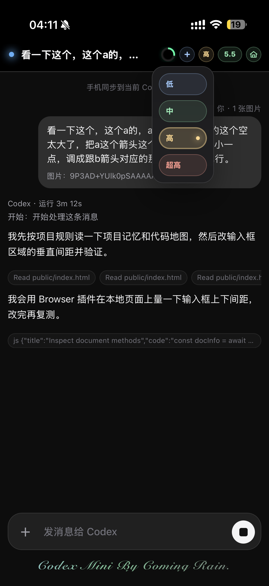
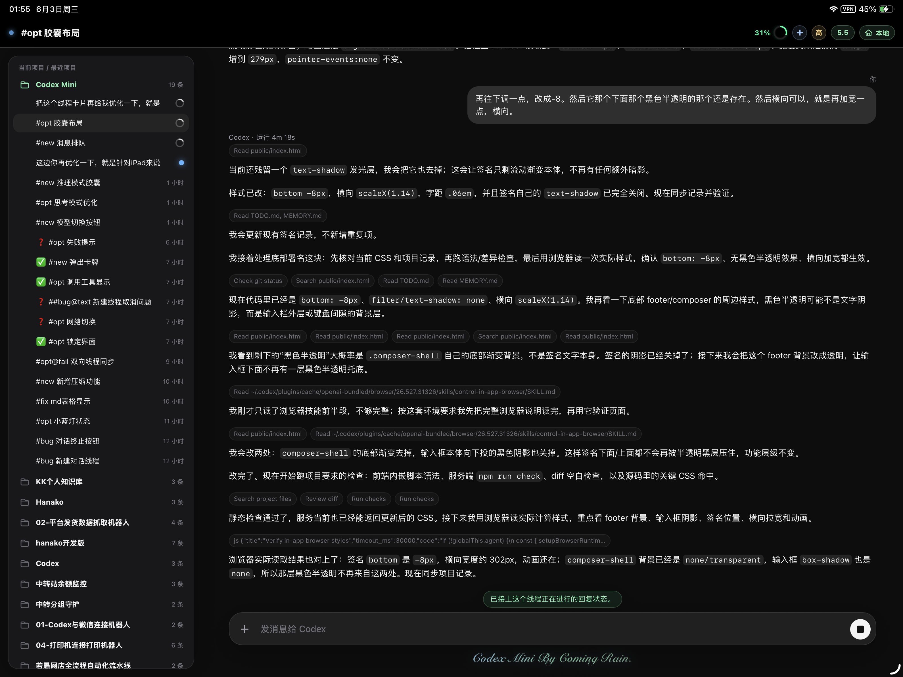
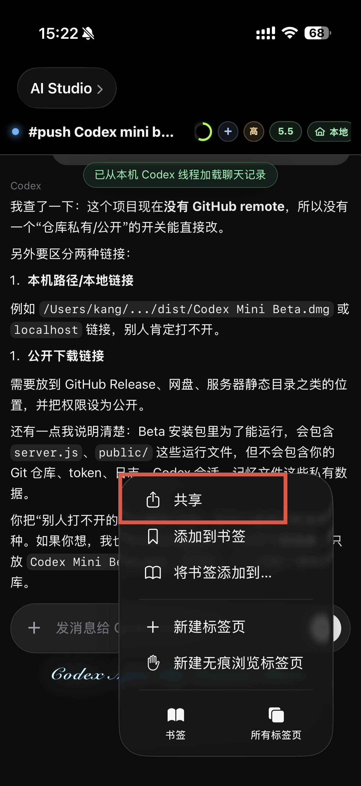
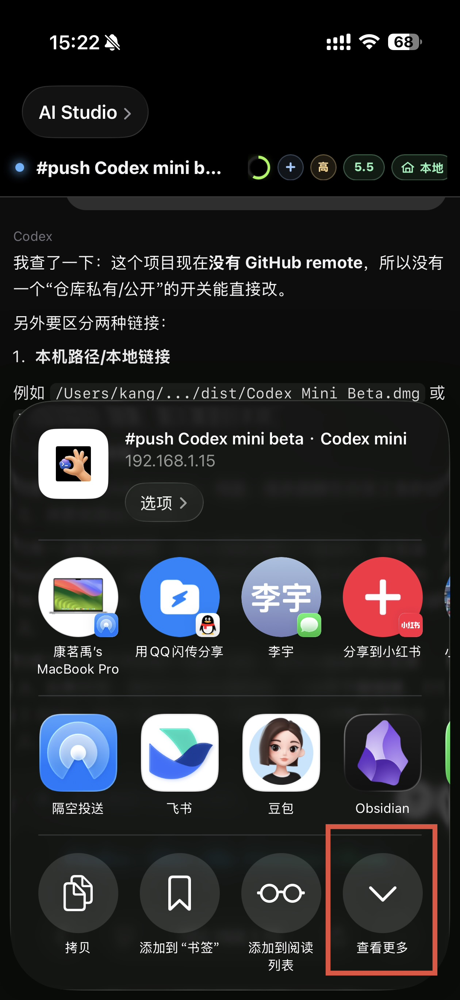
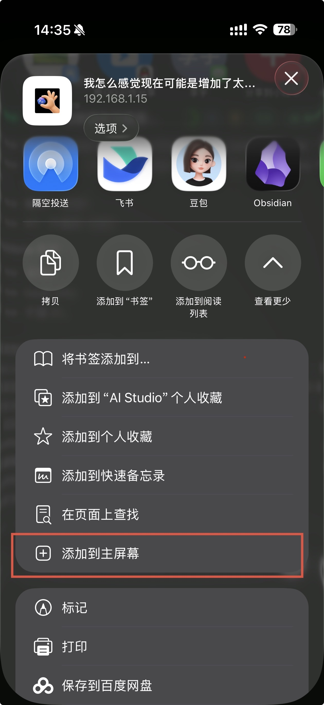

# GPT Mini

GPT Mini 是一个把手机浏览器连接到电脑 ChatGPT 中 Codex 的轻量桥接工具。你可以在手机上发送文字、图片、视频和文件，并同步查看 Codex 的回复过程和结果。

> 📌 **说明**
>
> **重大更新：官方构建版现在支持 macOS 和 Windows。**
>
> macOS 用户下载 DMG 安装包；Windows 用户下载 EXE 安装包，在 Windows 电脑或 Windows 虚拟机内安装使用。
>
> 本仓库也保留开源维护版本，适合有开发能力的朋友自行部署、改造和二次开发。构建版会优先提供最新功能，源码可能不会第一时间同步全部能力。

## 🐛 反馈 Bug / 提建议

遇到问题或有建议？**[→ 点这里提交反馈](http://47.110.74.238/codex-mini-feedback/)** —— 发一张截图 + 写一段话，开发者会直接看到并处理；也可以加 **QQ 群：760669553**。

## 当前发布版本

- 版本：v5.2.2（macOS 与 Windows 已对齐）
- 🍎 macOS · Apple 芯片（M1/M2/M3/M4…）：[GPT Mini v5.2.2（Apple Silicon 版）](https://github.com/CoimgRain/Codex-Mini/releases/download/codex-mini-v5.2.2/GPTMini_v5.2.2_macOS_AppleSilicon.dmg)
- 💻 macOS · Intel 芯片（x86）：[GPT Mini v5.2.2（Intel Mac 版）](https://github.com/CoimgRain/Codex-Mini/releases/download/codex-mini-v5.2.2/GPTMini_v5.2.2_macOS_Intel.dmg)
- 🪟 Windows（10 / 11，64 位）：[GPT Mini v5.2.2（Windows 版）](https://github.com/CoimgRain/Codex-Mini/releases/download/codex-mini-v5.2.2/GPTMini_v5.2.2_Windows_Setup.exe)
- 🤖 **Android 手机专用**：[GPT Mini Android v1.3（安卓版）](https://github.com/CoimgRain/Codex-Mini/releases/download/codex-mini-v5.2.2/Codex-Mini-Android-v1.3.apk)
- 图文安装说明：[macOS 版（PDF）](docs/Codex%20Mini%20Mac%20%E5%AE%89%E8%A3%85%E4%BD%BF%E7%94%A8%E8%AF%B4%E6%98%8E.pdf) ｜ [Windows 版（PDF）](docs/Codex%20Mini%20Windows%20%E5%AE%89%E8%A3%85%E4%BD%BF%E7%94%A8%E8%AF%B4%E6%98%8E.pdf)
- Release 页面：[codex-mini-v5.2.2](https://github.com/CoimgRain/Codex-Mini/releases/tag/codex-mini-v5.2.2)
- 安装方式：macOS 打开 DMG 并把 `GPT Mini.app` 拖进 `Applications`；Windows 双击 EXE 安装（无需管理员权限、无需自己安装 Node）；Android 下载 APK 后按系统提示安装

### 最新版 V5.2.2

- **回复真正实时显示**：GPT 思考过程和正文可持续增量呈现，并减少完成后重复播放或重新渲染
- **原生计划卡片**：任务执行时可查看当前步骤、整体进度和代码改动概览
- **多设备连接**：Max 用户可保存多台电脑并快速切换，主设备权限和设备状态同步更稳定
- **iOS 消息通知**：Pro / Max 用户可通过 Bark 接收任务完成与异常中断提醒
- **模型控制更准确**：新建任务可立即识别并切换模型、推理强度和快速模式，模型名称与闪电状态显示更稳定
- **移动端细节优化**：改进 iPad 线程侧栏、长标题、置顶样式、设备配色和流式 Markdown 显示

### GPT Mini V5 重大更新总览

- **适配最新 ChatGPT / Codex 合并客户端**：Mac 与 Windows 均可继续启用受控 GPT，线程、模型、推理和工具过程均按新版客户端适配
- **产品正式更名 GPT Mini**：新 App、安装包、控制面板和手机端统一品牌，覆盖升级时保留原有授权、设置、线程和访问信息
- **全新液态玻璃界面**：顶部状态、线程列表、输入区、菜单和设置面板重新统一，同时优化 iPhone、iPad 和电脑浏览器布局
- **移动控制体验全面升级**：线程切换、历史缓存、工具胶囊、模型/推理/快速模式、配额圆环、附件预览和待发送队列均完成一轮系统优化

### 历代大版本回顾

- **V4**：建立全 CDP 控制链路，补齐附件、设置、SSH 远程线程、Windows 安装包和多平台发布流程
- **V5**：以合并后的 ChatGPT / Codex 客户端为新基线，完成 GPT Mini 品牌、液态玻璃 UI、完整状态面板和 Mac / Windows 后端能力对齐

## 界面预览

  
  
  

  

## 加入交流群

QQ 群：**760669553**

欢迎加入群里交流使用问题、反馈 bug、提出功能建议。后续有最新版本也会在群里及时沟通。

## Windows 版本

官方 Windows 安装包已经随最新 Release 一起发布，文件名是 `GPTMini_v5.2.2_Windows_Setup.exe`。Windows 版支持在 Windows 桌面环境中运行 GPT Mini 控制面板，并保留手机网页控制、线程列表、CDP 受控 Codex、局域网访问和 Pro 外网入口等核心能力。

## Android 版本

Android 手机专用安装包已经随最新 Release 一起提供，文件名是 `Codex-Mini-Android-v1.3.apk`。如果你使用安卓手机，直接下载 APK 到手机安装即可；桌面端仍需在自己的 Mac 或 Windows 电脑上运行 GPT Mini。

社区项目 [atuizz/codex-max](https://github.com/atuizz/codex-max) 仍可作为另一个 Windows 方向参考。

## 安装与使用

1. 按系统下载对应的 `GPTMini_v5.2.2_macOS_AppleSilicon.dmg`、`GPTMini_v5.2.2_macOS_Intel.dmg`、`GPTMini_v5.2.2_Windows_Setup.exe`；安卓手机用户下载 `Codex-Mini-Android-v1.3.apk`
2. macOS 安装前完整删除旧 `Codex Mini Beta.app`，建议用第三方卸载工具清理旧 App、旧 LaunchAgent 和旧运行目录
3. macOS 打开 DMG，把 `GPT Mini.app` 拖到 `Applications`；Windows 直接运行 EXE 安装；Android 下载 APK 后按系统提示安装
4. 打开 GPT Mini
5. 同一 Wi‑Fi 下可直接使用局域网入口；离开局域网可使用 Pro 外网入口
6. 建议把手机网页添加到主屏幕，体验更接近 App

## 添加到主屏幕

iPhone 上打开 GPT Mini 网页后，按下面三步操作：

1. 点浏览器底部或菜单里的“分享”
2. 如果没看到“添加到主屏幕”，先点“查看更多”
3. 点“添加到主屏幕”，之后从桌面图标打开 GPT Mini

> 第一次使用时，macOS 可能需要给 ChatGPT 或 GPT Mini 相关自动化操作授予辅助功能/自动化权限，否则无法把手机输入粘贴并发送到 ChatGPT 中的 Codex。

  
  
  

## 当前版本实现原理

GPT Mini 不是云端聊天服务，真正的 Codex 登录状态、线程切换、输入和回复读取都发生在你自己的电脑上。

核心流程：

1. 电脑上由 GPT Mini 管理本地服务
2. 手机网页把文字或附件发送到这台电脑
3. 本地服务通过 CDP 控制 ChatGPT 中的 Codex，把内容发送到当前线程
4. 本地服务读取 Codex 会话状态和回复，并同步回手机网页
5. 同一 Wi‑Fi 优先走局域网入口；开启 Pro 后可走外网中转入口

## 本地免费与 Pro 会员

- 本地局域网功能永久免费：手机和电脑在同一个 Wi‑Fi / 局域网下即可使用
- Pro 会员解锁外网入口：通过服务器中转连接自己的电脑，不在同一个 Wi‑Fi 下也可以使用
- 当前支持 7 天免费试用、月度、季度和年度计划
- Pro 激活后请重新复制新的外网入口到手机上；旧的局域网入口只适合同一网络下使用

## 服务器中转与隐私安全

GPT Mini 的设计原则是：用户自己的电脑为主，服务器只做必要中转。

- Codex 登录状态、线程内容和本机访问令牌都保存在用户自己的电脑上
- 外网入口只把手机请求转回对应用户的电脑，不提供管理员远程打开用户电脑或查看线程的入口
- Pro 授权使用设备绑定和签名校验
- 请不要把自己的访问链接、令牌或电脑隐私信息发给陌生人

## 注意事项

- 请确保电脑上已经安装并登录最新 ChatGPT（内含 Codex）
- 请保持 ChatGPT 中的 Codex 可正常使用
- 请不要把自己的访问链接、令牌或电脑隐私信息发给陌生人
- 当前 V5.x 采用全 CDP 控制方案；如果你使用 Codex++ 或其他 CDP 工具，请只保留一个，避免冲突。安装前请彻底删除旧 Codex Mini Beta，旧残留可能导致无法启用受控 Codex。欢迎进群反馈

## 源码说明

本仓库提供 GPT Mini 的开源维护版本，适合希望自行部署、接入自己的服务器或进行二次开发的用户。

如果你更希望开箱即用，或者想优先体验最新功能，建议直接下载 Releases 中的 DMG 构建版。构建版会持续维护，部分新功能可能会先在构建版中发布，再逐步同步到开源版本。

## License / 授权

GPT Mini is **source-available for non-commercial use only**. You may read, fork, modify, and publish derivative works for personal, educational, research, evaluation, and other non-commercial purposes.

Commercial use requires prior written authorization from the author. Without authorization, you may not sell this project, operate a paid hosted/SaaS/relay service based on it, charge for deployment or maintenance, resell access, or otherwise monetize this project or derivative works.

If you fork, modify, redistribute, or publish a derivative work, you must keep clear attribution to the original project and author: **GPT Mini by [CoimgRain](https://github.com/CoimgRain)**, with a link to the original repository: https://github.com/CoimgRain/Codex-Mini

This is not an OSI-approved open source license because it restricts commercial use. See [`LICENSE`](./LICENSE) for the full terms.

中文说明：GPT Mini 仅允许个人、学习、研究、评估等非商业用途使用。允许 fork、修改和继续公开发布，但必须保留对原项目和作者的清晰署名：**GPT Mini by [CoimgRain](https://github.com/CoimgRain)**，并附上原项目链接：https://github.com/CoimgRain/Codex-Mini。未经作者事先书面授权，不得用于商业服务、付费托管、SaaS、中转服务、代部署收费、转售访问权或其他商业化用途。
